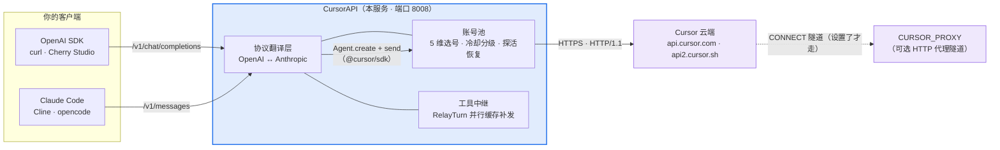

<p align="center">
<pre>
╔════════════════════════════╗
║ CursorAPI               ║
║ Cursor API Key Pool        ║
║ OpenAI / Anthropic Gateway ║
╚════════════════════════════╝
</pre>
</p>

# CursorAPI

> 把一池 Cursor API key 变成 OpenAI / Anthropic 双协议标准 API。客户端点什么模型就用什么模型，号由网关挑、坏了自动换，客户端全程无感。

<p align="center">
  <a href="https://github.com/dwgx/cursorapi/stargazers"></a>&nbsp;
  <a href="https://github.com/dwgx/cursorapi/blob/main/package.json"></a>&nbsp;
  <a href="https://github.com/dwgx/cursorapi/releases/latest"></a>&nbsp;
  <a href="https://github.com/dwgx/cursorapi/actions/workflows/release.yml"></a>
</p>

# 声明

> 本服务前端的是一整个 Cursor 账号池的额度，请只给信得过的人发 key，不要公开部署成免费中转站。代码本体按 ISC License 开源（`package.json` 的 license 字段），上面这段是作者个人态度。

---

**两套标准 API 同时兼容**：

- `POST /v1/chat/completions` — **OpenAI 兼容**，任何 OpenAI SDK 直接用
- `POST /v1/messages` — **Anthropic 兼容**，Claude Code / Cline 直接连
- `GET /v1/models` — 同一份模型目录，**双格式输出**：带 `x-api-key` 头回 Anthropic 格式，带 `Bearer` 回 OpenAI 格式

**模型**：目录不是写死的，启动时从 Cursor 云端拉取（当前实测约 35 个模型，随账号 entitlement 变化），60 分钟缓存。模型名直接写 Cursor 的 id，可带 `[参数]` 后缀：

```
claude-opus-5[1m,max]     composer-2.5      gpt-5.6-sol[1m,high]
claude-sonnet-4-6         gemini-3.1-pro    kimi-k3[max]
```

方括号里是模型参数，裸词即可（`1m` / `max` / `thinking`），网关自动对到正确的维度上。`GET /v1/models` 会把每个模型支持哪些参数一并列出来。纯 Node.js ESM、零框架，唯一运行时依赖 `@cursor/sdk`。

> **`fast` 和 `thinking` 默认强制关闭。** 不是优化，是防止意外烧钱：模型自带的默认变体不一定是便宜那个——实测 `composer-2.5-fast` 一次调用扣 **2** 个 request，而 opus-4.6-max 跑 422 万 token 只扣 1 个。要开就显式写 `[fast]` / `[thinking]`，或用 `CURSOR_MODEL_DEFAULTS` 按模型补默认参数。

<sub>关键词：Cursor API 池 · OpenAI/Anthropic 网关 · Claude Code 中转 · Cursor 镜像 · 账号池轮换 · AI 中转 API · Cursor 逆向</sub>

<p align="center">
  <a href="#它到底在干嘛">原理</a> ·
  <a href="#快速开始">5 分钟跑起来</a> ·
  <a href="#客户端接入">客户端接入</a> ·
  <a href="#管理面板">管理面板</a> ·
  <a href="docs/ENV-SWITCHES.md">环境开关</a> ·
  <a href="docs/DEPLOY.md">部署</a> ·
  <a href="docs/ARCHITECTURE.md">架构</a>
</p>

## 它到底在干嘛



<details>
<summary>纯文本版（不支持 mermaid 的环境）</summary>

```
     ┌─────────────┐   /v1/chat/completions   ┌────────────────────┐
     │ OpenAI SDK  │ ────────────────────────→ │                    │
     │ curl 前端   │ ←────────────────────────  │                    │
     └─────────────┘    OpenAI JSON + SSE      │   CursorAPI     │
                                               │   (Node.js · 8008) │   ┌──────────────────────┐
     ┌─────────────┐   /v1/messages            │                    │   │ Cursor 云端          │
     │ Claude Code │ ────────────────────────→ │  协议翻译层         │   │ api.cursor.com       │
     │ Cline       │ ←────────────────────────  │  ├─ 账号池(5维选号)│──→│ api2.cursor.sh       │
     └─────────────┘    Anthropic SSE          │  └─ 工具中继        │   │  (经 CURSOR_PROXY 可选)│
                                               └────────────────────┘   └──────────────────────┘
```

</details>

**它做了什么**：

1. 一个 HTTP 服务（端口 8008）同时暴露 OpenAI 和 Anthropic 两套 API
2. 客户端发来的整段历史折叠成一个 prompt，通过 `@cursor/sdk` 的 `Agent.create + send` 发给 Cursor 云端
3. 维护账号池：选号（5 维排序 + 档内轮转）、失败分级冷却、定期探活自动恢复
4. 带 `tools` 的请求进入**工具中继**：Cursor 的 agent 只能调用客户端声明的工具，调用被翻成 `tool_calls` 交回客户端本地执行，结果回传后同一个 run 继续跑

## 能力清单

| 能力 | 说明 |
|---|---|
| 双协议 | OpenAI `/v1/chat/completions` + Anthropic `/v1/messages`，流式 / 非流式都支持 |
| 动态模型目录 | 启动时从 Cursor 云端拉取（约 35 个），1 小时缓存，`[参数]` 后缀自动对维度 |
| 账号池 | 5 维选号（健康 / 新号冷却 / 在飞 / RPM / 优先级）· 429/5xx/鉴权/quota 分级冷却 · `Cursor.me()` 探活恢复 · 热重载不中断服务 |
| 工具中继 | 客户端声明的工具翻成 `tool_calls` 交回客户端执行，并行调用批量下发、断流缓存补发 |
| 热配置 | `PUT /admin/config` 即时改运行时参数，重启才生效的字段自动进 `restartFields` |
| OTA 更新 | git / zip 双模式，崩溃循环自动回滚守卫，面板一键检查 / 执行 |
| 多平台 | Docker 镜像（GHCR 多架构）+ 单二进制（Linux / macOS / Windows）+ 源码运行 |
| 管理面板 | 登录会话 · 账号批量导入导出 · 日志 SSE 实时流 + 最近请求明细 · 模型厂商分组 · 用量统计 · 设置 · 更新 |

## 快速开始

需要 Node **≥ 22.13**（`@cursor/sdk` 的要求）。

### Docker（一行）

```bash
docker run -d --name cursorapi \
  -p 8008:8008 \
  -e CURSOR_CLIENT_KEYS=sk-给客户端用的key \
  -e CURSOR_ADMIN_KEY=管理口令 \
  -v $(pwd)/data:/data \
  ghcr.io/dwgx/cursorapi:latest
```

首次启动会自动拉取镜像（GHCR，linux/amd64 + arm64）。`/data` 里放 `accounts.json`（见下）。

或者用仓库自带的 compose：

```bash
cp .env.example .env              # 填 CURSOR_CLIENT_KEYS / CURSOR_ADMIN_KEY
mkdir -p data work
cp accounts.example.json data/accounts.json   # 填你的 Cursor key
chmod 600 .env data/accounts.json
docker compose up -d --build
```

### 单二进制

从 [GitHub Releases](https://github.com/dwgx/cursorapi/releases/latest) 下载对应平台的 `cursorapi-*`，直接跑：

```bash
./cursorapi-linux-x64
# macOS:  ./cursorapi-macos-arm64
# Windows: .\cursorapi-win-x64.exe
```

### 源码运行

```bash
git clone https://github.com/dwgx/cursorapi.git
cd cursorapi
npm install          # 唯一依赖 @cursor/sdk（带平台原生模块）
cp .env.example .env
cp accounts.example.json data/accounts.json   # 注意先建 data/ 目录
node boot.mjs
```

### 最小配置（.env）

```bash
# 必填：调用方 key（逗号分隔多把）；留空 = 不鉴权，只允许 localhost 场景
CURSOR_CLIENT_KEYS=sk-give-this-to-clients
# 管理口令；留空则复用 client keys（客户端能看到账号池内部）
CURSOR_ADMIN_KEY=
# 账号池文件路径（改动后 POST /admin/reload 或点状态页「重载」即生效）
CURSOR_ACCOUNTS=/data/accounts.json
# 国内部署必填：Cursor 按出口区域限制推理流，且 SDK 忽略系统代理
# 设了之后强制 HTTP/1.1 + CONNECT 隧道（见 docs/ARCHITECTURE.md）
CURSOR_PROXY=http://127.0.0.1:10808
```

`data/accounts.json`：

```json
[
  { "name": "一号机", "key": "crsr_你的key", "priority": 0 },
  { "name": "兜底号", "key": "crsr_你的key", "priority": 99 }
]
```

**选号**：未禁用 → `priority` 最小的那一档 → 档内轮转。想让某个号少用/兜底，把 priority 调大。
**换号**：一次请求最多试 3 个号（`CURSOR_MAX_ACCOUNT_ATTEMPTS`），换号发生在**开始输出之前**，客户端完全看不到失败——只会觉得这次稍慢了一点。

**什么时候号会被自动禁用：只有一种情况——key 失效**（`AuthenticationError` / 401）。这个判据是实测过的，精确可辨，所以敢做「禁用」这种不可逆动作。其余失败一律只换号、不禁号。

### 跑起来了吗

```bash
curl localhost:8008/ping                                        # ok
curl -H "Authorization: Bearer $CURSOR_CLIENT_KEYS" \
     localhost:8008/v1/models | head                            # 模型列表
open http://localhost:8008/admin                                # 管理面板（用管理口令登录）
```

## 客户端接入

### Claude Code（Anthropic 协议）

```bash
export ANTHROPIC_BASE_URL=http://你的地址:8008
export ANTHROPIC_API_KEY=你的client_key        # 或 ANTHROPIC_AUTH_TOKEN
claude                # 正常用 Claude Code 即可
```

Claude Code 发 `x-api-key` 头，网关按 Anthropic 格式回。`/v1/messages` 支持 system + tools + tool_use + tool_result + stream + multi-turn 全套。

### OpenAI SDK

```python
from openai import OpenAI
client = OpenAI(base_url="http://你的地址:8008/v1", api_key="你的client_key")
r = client.chat.completions.create(
    model="claude-opus-5",
    messages=[{"role": "user", "content": "你好"}],
)
print(r.choices[0].message.content)
```

### curl：普通对话

```bash
# OpenAI 格式
curl http://localhost:8008/v1/chat/completions \
  -H "Authorization: Bearer 你的client_key" \
  -H 'content-type: application/json' \
  -d '{"model":"claude-sonnet-4-6","messages":[{"role":"user","content":"你好"}]}'

# Anthropic 格式
curl http://localhost:8008/v1/messages \
  -H "x-api-key: 你的client_key" \
  -H "anthropic-version: 2023-06-01" \
  -H 'content-type: application/json' \
  -d '{"model":"claude-sonnet-4-6","max_tokens":1000,"messages":[{"role":"user","content":"你好"}]}'
```

### curl：工具调用（两轮）

按请求带不带 `tools` 自动分两种模式：**不带** → agent 用它自带的工具干完活只把结论交回来；**带** → 工具中继，agent 只能用客户端声明的工具。

```bash
# 第一轮：声明工具，拿到 tool_calls
curl -N http://localhost:8008/v1/chat/completions \
  -H "Authorization: Bearer 你的client_key" -H 'content-type: application/json' \
  -d '{"model":"claude-sonnet-4-6","stream":true,
       "messages":[{"role":"user","content":"北京现在几点？"}],
       "tools":[{"type":"function","function":{
         "name":"get_time","description":"查任意城市当前时间",
         "parameters":{"type":"object","properties":{"city":{"type":"string"}},"required":["city"]}}}]}'

# 第二轮：带上 tool 结果回传，同一个 run 继续跑
curl -N http://localhost:8008/v1/chat/completions \
  -H "Authorization: Bearer 你的client_key" -H 'content-type: application/json' \
  -d '{"model":"claude-sonnet-4-6","stream":true,
       "messages":[
         {"role":"user","content":"北京现在几点？"},
         {"role":"assistant","content":null,
          "tool_calls":[{"id":"call_<上一轮返回的id>","type":"function",
            "function":{"name":"get_time","arguments":"{\"city\":\"北京\"}"}}]},
         {"role":"tool","tool_call_id":"call_<上一轮返回的id>","content":"2026-08-13 10:00"}]}'
```

中继细节（并行调用批量下发、断流缓存补发、工具超时）见 [docs/ARCHITECTURE.md](docs/ARCHITECTURE.md) 的「工具中继」一节。

已知边界：

- **只认 `type:"function"` 的工具**。Codex 的自由文本工具（`type:"custom"`）、Anthropic 的原生 server tool 会被跳过（有日志，不静默）。
- **「派子程序」类工具默认被挡**（`Task` / `subagent` / `*_agent` / `best-of-n`）。一轮里派 5 个子程序 = 6 次计费，而客户端看不出钱花在哪。要并行就设 `CURSOR_ALLOW_SUBAGENTS=true`。前缀匹配，`taskStatus` 这类会被误伤。
- customTools 是 **local runtime 专属**，cloud agent 不支持（SDK 文档明写）。
- 工具调用是**本地执行**的：网关只负责传递 `tool_use` / `tool_result`，真正执行工具的是客户端（Claude Code 之类在本机跑命令/改文件）。

## 管理面板

打开 `http://你的地址:8008/admin`，用管理口令登录（会话 12 小时，内存态，重启要重登）。

| 功能 | 说明 |
|---|---|
| 账号管理 | 加号（先验 key 再落盘）、批量导入（坏的跳过好的照加，上限 200）、批量启停/探活/删除（上限 500）、导出（只含掩码）、改名字/优先级、搜索过滤、冷却倒计时、一键复制完整 Key |
| 模型目录 | 全量模型 + 厂商分组 + 参数维度 |
| 日志 | 实时 SSE 流（回放最近 50 条 + 15s 心跳，断线自动重连）+ 最近请求明细表（一个请求一行，点击展开详情）+ jsonl/txt 导出 |
| 统计 | 总量 / 模型维度 / 账号维度 / 小时桶（30 天），含成功率与平均延迟；图表带图例（区间合计）、Y 轴从 0 起取整刻度、tooltip 显示成功率 |
| 设置 | 配置热更（`GET`/`PUT /admin/config`，secret 脱敏，重启才生效的字段标 `restartOnly`） |
| 更新 | 检查更新 / 执行更新（`CURSOR_OTA_ENABLED=true` 才放行）/ 回滚点状态 |

管理 API 一览：

```
POST   /admin/login                   登录（body: {"key":"管理口令"}，返回会话 cookie）
POST   /admin/logout                  登出
GET    /admin/status                 账号池快照 JSON
GET    /admin/models                 模型目录
POST   /admin/reload                 热重载账号池文件
POST   /admin/accounts               加一个号  body: {"key":"crsr_…","name":"","priority":0}
POST   /admin/accounts/batch         批量  body: {"items":[…]}|{"ids":[…],"op":"disable|enable|probe|delete"}
GET    /admin/accounts/export        导出账号（只含掩码 key）
PATCH  /admin/accounts/{id}          改名字 / 改优先级
DELETE /admin/accounts/{id}          删号（用量记录一并丢弃）
POST   /admin/accounts/{id}/disabled 启停  body: {"disabled":true}
POST   /admin/accounts/{id}/probe    手动探活
GET    /admin/config                 当前生效配置（secret 脱敏）
PUT    /admin/config                 部分热更（restart-only 字段进 restartFields）
GET    /admin/logs                   SSE 日志流
GET    /admin/logs/export            导出日志（jsonl|txt）
GET    /admin/requests               最近请求明细（环形缓冲，默认 50 条，上限 500）
GET    /admin/stats                  用量聚合（总量/模型/账号/小时桶）
GET    /admin/update/check           检查更新
POST   /admin/update/perform         执行更新（CURSOR_OTA_ENABLED=true 才放行）
GET    /admin/update/status          健康标记 / 回滚点状态
```

## 关于额度：查不到，只能自己记

**Cursor 没有「这个号还剩多少」的接口。** 实测（2026-08-12，两个不同账号）`Agent.getUsage()` 一律返回 `403 feature_unavailable`，那是 Team/Enterprise 专属。

所以网关的做法是：

| 想知道的 | 怎么来 | 成本 |
|---|---|---|
| 这个号是谁 | `Cursor.me()`（邮箱、key 名、创建时间） | 免费 |
| key 还有效吗 | 定期 `Cursor.me()`，401 就禁用 | 免费 |
| 用了多少 | 自己数 run 次数 + 累计 token | 免费 |
| 额度用完了吗 | **打到报错才知道**，然后自动换号 | 一次失败请求 |

**刻意不做「发够 N 次就换号」的主动阈值**：你根本不知道每个号的额度是多少，套餐、credit grant、team pool 各不相同，订阅内用量的 `chargedCents` 恒为 0，连个可比的数都没有。设小了浪费额度，设大了照样撞墙。「调用次数」这个读数最接近 Cursor 的真实计费口径——它就是按 request 计数的。

## 测试

不需要网络、不花钱：

```bash
npm test
# node test-keys.mjs          # 错误归类、选号、热重载不丢状态、key 不泄露
# node test-format.mjs        # messages → prompt
# node test-protocol.mjs      # 双协议线格式、usage 字段名
# node test-tool-relay.mjs    # 工具注册/拦截/结果对号
# node test-guard-auth.mjs    # 鉴权
# node test-ui.mjs            # 管理界面（跑页面脚本 + 打真服务）
# node test-sessionauth.mjs   # 会话级鉴权失效处置
# node test-runtime-settings.mjs  # 配置热更新
# node test-updater.mjs       # OTA（版本/守卫/回滚）
# node test-rate-limit.mjs    # 入站限流（XFF 信任模型、伪造换桶）
# node test-relay-cancel.mjs  # run 取消资源释放（load hook 伪造 SDK，配 test-relay-hook.mjs）
# node test-http-helpers.mjs  # 响应/读体
# node test-logger.mjs        # 日志分级/环形缓冲
```

要花额度的验证（一次 1 个 request）：起服务后真发一条请求。

## 还没解决的

**「额度耗尽」时 SDK 报什么错，目前没有实测样本**（普通账号连 `getUsage()` 都是 403，没法主动制造一个耗尽状态）。它现在会落到通用规则里当成「换号重试」处理——行为是对的，只是不够精确。

每一次失败都会把完整的错误形状记进日志：`name / code / status / isRetryable / endpoint / operation / message`。撞上第一次就能一眼认出它长什么样，然后在 `src/keys.mjs::classify` 里加一条规则即可，不用改别处。

## 文档导航

- [docs/ENV-SWITCHES.md](docs/ENV-SWITCHES.md) — 全部 `CURSOR_*` 配置项：默认值、语义、热更还是重启生效、是否脱敏
- [docs/DEPLOY.md](docs/DEPLOY.md) — 部署三形态（Docker / 单二进制 / 源码）、OTA 更新与回滚、端口/防火墙/代理注意事项
- [docs/ARCHITECTURE.md](docs/ARCHITECTURE.md) — 模块架构与数据流、工具中继机制、OTA 回滚守卫、记账体系

## 授权

ISC License（`package.json` 的 license 字段；LICENSE 文件待补充）。

## 发布与密钥边界

发布流水线（tag push `v*` 触发）会自动推 GHCR 多架构镜像和 GitHub Release（含 sha256 校验文件），tag 必须与 `package.json` 的 version 一致才会放行。**别把 Cursor key、API key、cookie、账号凭据写进 issue、PR、日志或提交的配置文件里。** 账号池文件（`data/accounts.json`）和 `.env` 都在 `.gitignore` 里，提交前先 `git status` 确认。
