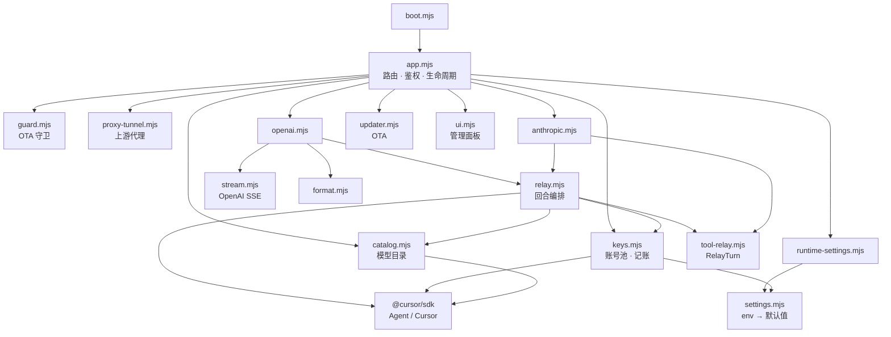
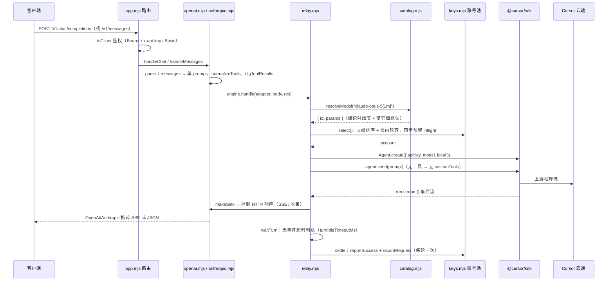
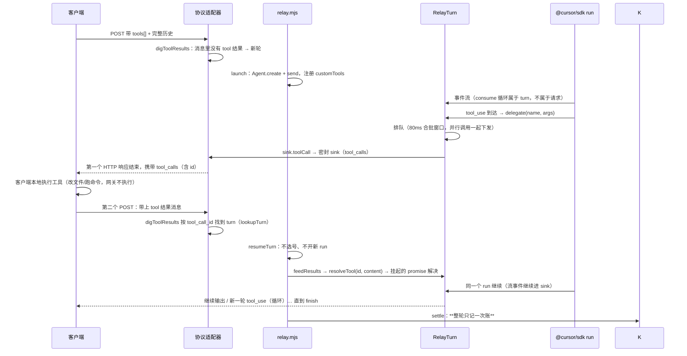

# 架构

本文描述 CursorAPI 的模块划分、请求数据流、工具中继机制、OTA 回滚守卫与记账体系。所有描述对应当前 `src/` 源码（v0.1.0）。

## 1. 总览

零框架的纯 Node.js ESM 服务，唯一运行时依赖 `@cursor/sdk`。核心设计思想：

- **协议适配与业务编排分离**：`openai.mjs` / `anthropic.mjs` 只管「线格式」，`relay.mjs` 是协议无关的回合编排器，`keys.mjs` 是账号池，`tool-relay.mjs` 是工具中继状态机。加新协议 = 写一个新适配器，不改编排。
- **一次请求 = 一次 run = 一次计费**：整段对话历史折叠成单个 prompt 发给 Cursor，工具往返不是新轮。
- **换号只发生在输出开始之前**：流一旦开始，切换就是把两个大脑粘进同一个回答，绝不做。
- **可观测性优先**：每次失败记完整错误形状（`name/code/status/isRetryable/endpoint/operation/message`），首次撞上未知错误就能认出它。

## 2. 模块清单

```
boot.mjs                 启动入口：OTA 崩溃守卫先跑（guard.bumpBootAttempts），再加载 src/app.mjs
src/app.mjs              HTTP 入口：路由、两级鉴权、生命周期、重启钩子
src/guard-auth.mjs       鉴权：client（/v1/*）与 admin（/admin/*）两级，常量时间比较
src/sessions.mjs         管理面会话：内存 token，12h TTL，暴力破解延迟惩罚（不锁死）
src/settings.mjs         静态配置：env → 默认值，启动时求值一次，坏值启动即抛
src/runtime-settings.mjs 热配置层：runtime-config.json 覆盖，注册表 + 类型校验 + 原子写盘 + 脱敏
src/catalog.mjs          模型目录：上游动态拉取 + 1h 缓存 + name[参数] 解析 + 便宜档默认
src/openai.mjs           OpenAI 适配器：/v1/chat/completions 解析与响应成形
src/anthropic.mjs        Anthropic 适配器：/v1/messages 解析与响应成形
src/relay.mjs            回合编排：选号、failover、等轮、结算
src/keys.mjs             账号池：文件持久化、5 维选号、错误归类、冷却、探活、记账
src/tool-relay.mjs       工具中继：RelayTurn 状态机、批量合批、缓存补发、结果对号
src/format.mjs           纯函数：messages → 单 prompt、usage 字段映射
src/stream.mjs           OpenAI SSE 写入器 + 收集 sink
src/proxy-tunnel.mjs     上游代理注入：CONNECT 隧道 + HTTP/1.1 强制 + ProxyAgent
src/guard.mjs            OTA 启动守卫：崩溃计数、健康标记、回滚
src/updater.mjs          OTA 热更新：git/zip 双模式、版本门禁、镜像链下载、优雅重启
src/ui.mjs               管理面板：单文件 HTML（内嵌全部页面与脚本）
src/logger.mjs / http-helpers.mjs   日志（环形缓冲 + SSE 订阅）/ HTTP 帮手
```

依赖方向（高层不反向依赖底层，`keys.mjs` 不碰协议层）：



## 3. 请求数据流

### 3.1 普通对话（无工具）



要点：

- **failover 循环在 launch 里**：`select()` 失败 → `reportFailure` 分类 → `RETRY_OTHER` 则换号重试（429 按 Retry-After 睡，封顶 60s；无 RA 的 429 指数退避 1s→8s；其他固定 300ms）；`DISABLE_AND_RETRY` 禁用后换号；`RETURN`（参数错、模型不支持）直接抛给客户端。全部失败 → 502（试过号）/ 503（池空）。
- **idle 超时计的是「无事件」而不是总时长**：thinking 事件、工具调用、usage 事件都算活动，长时间不出字的思考阶段不会误杀。
- 池子预留（inflight）在 `consume().finally` 里恰好释放一次；sink 挂载失败会把预留还回去。

### 3.2 工具调用往返（工具中继）

工具中继的骨架：客户端声明的 `tools[]` 经适配器归一化成协议无关的 `{name, description, parameters}`，再注册成 SDK 的 `customTools`——**回调在网关进程里执行**，执行体是「挂起并转交客户端」，配合 `tools: ["mcp"]` 关掉 agent 自带的 read/edit/shell（`"mcp"` 是工具族白名单字符串，不是要配 MCP server；SDK 内部把 customTools 注册成 `extraMcpTools`）。



### 3.3 RelayTurn 状态机

```
                       delegate（工具调用到达）
                                │
                                v
      queued[] ──80ms 合批──→ #flush()
                                │
                     ┌──────────┴──────────┐
                     │ sink 开着           │ sink 已关
                     v                     v
              sink.toolCall(批量)     parked[]（缓存）
              #sealSink("tool_calls")    ↑
                     │                   │ 下个请求 attach 时重放
                     │                   │（agent 可能并发发多个 tool_use，
                     │                   │ 第一个 flush 关掉 sink 后到达的
                     │                   │ 不丢——丢=「连接被中断」假象）
                     v
             HTTP 响应结束，客户端拿到 tool_calls
                     │
                     │ 客户端 POST 回 tool 结果（可能跨多个 HTTP 请求）
                     v
             resolveTool(id, content) → pending 的 promise 解决
                     │
                     v
             run 继续 → 回到顶部循环，直到 finished
```

状态与关键字段：

| 字段 | 作用 |
|---|---|
| `pending: Map<callId, {resolve, reject, timer, name}>` | 等客户端回结果的挂起调用；每个都有 `toolResultTimeoutMs`（默认 10 分钟，等用户批准动作）定时器兜底 |
| `queued[]` + `flushTimer` | 80ms 合批窗口：背靠背的多个调用一起发给客户端，让它可以并行执行；窗口小，单个调用不会被拖 |
| `parked[]` | sink 已关闭时到达的调用缓存，下个请求 attach 时重放（日志会打 `replaying N cached tool call(s)`） |
| `sink` / `sinkRelease` | 当前挂着的 HTTP 响应；`attach()` 会顶掉旧的（客户端断线重发场景，不释放旧 promise 则前一个请求处理器永远 await） |
| `pendingText` | sink 关闭期间积压的文本，attach 时先补发 |
| `callIdPrefix` | `call_`（OpenAI）/ `toolu_`（Anthropic）。不是装饰：Anthropic 客户端把 `tool_use.id` 原样回显成 `tool_result.tool_use_id`，严格实现把 `call_` 前缀当异常数据 |
| `account` | 本轮绑定的账号——工具往返必须继续用同一个号，中途换号 = 换大脑 |
| `usage` | 流里最后一次 usage 事件，密封时交给 sink 转线格式 |

不变量（文件头注释明写）：

1. 一个 turn 恰好一个 run；工具往返跨多个 HTTP 请求，turn 活得比发起它的请求长。
2. 工具调用永不丢弃：合批窗口内缓存、sink 关闭时缓存、重放。
3. 每个 pending 调用都有超时兜底。
4. sink 收到的是 SDK 原始 usage，**线格式转换是 sink 的职责**——曾经在 turn 里统一转，结果 Anthropic 想要的 `input_tokens` 和 OpenAI 想要的 `prompt_tokens` 各缺一半，统计列悄悄空白。

工具过滤规则：

- 只认 `type:"function"`；Codex 自由文本工具（`type:"custom"`）、Anthropic server tool（无 `input_schema`）被跳过（有日志）。
- 「派子程序」类默认挡（`CURSOR_ALLOW_SUBAGENTS=true` 放开）：`task` / `subagent` / `best-of-n` / `(spawn\|launch\|create\|run\|start\|dispatch\|delegate)-*agent` 前缀匹配——一轮 5 个子程序 = 6 次计费，客户端看不出钱花哪。
- 工具没写 description 时从参数 schema 蒸馏一行摘要（Cursor 里空描述的工具被调用的概率明显更低）。
- 中继是 **local runtime 专属**；cloud agent 不支持 customTools（SDK 文档明写）。

## 4. 账号池（keys.mjs）

### 4.1 选号：5 维排序 + 档内轮转

```
rankVector = [disabled?1:0, 新号宽限期?1:0, inflight, rpm(60s 滑动), priority]
```

排序后取最小向量组成同一档，档内 round-robin（`rrCursor`）。维度含义：

| 维度 | 说明 |
|---|---|
| 健康 | 禁用（配置禁用 + 自动禁用）直接出局 |
| 宽限期 | 加入 < 5 分钟的新号排后，防止冷号被打头阵 |
| 在飞数 | 已预留未释放的请求数，最少的先上 |
| RPM | 过去 60 秒的请求数（滑动窗口，选号时同步预留），最低的先上 |
| priority | 用户指定的档位，兜底号调大 |

`select()` 同步预留 `inflight` 并记录 rpm 槽位——消除「选好了但还没用上」的窗口。被排除的号（本请求已试过）不再进候选。

### 4.2 失败分类（classifyError）与冷却分级

```
401 / AuthenticationError                     → DISABLE_AND_RETRY（禁用，探活可恢复）
会话级鉴权错误（消息含 "authentication error"） → DISABLE_AND_RETRY（禁用，走 10 分钟冷却自动重试）
SDK 标 isRetryable / 403 / 429 / 5xx          → RETRY_OTHER
其余（参数错、模型不支持）                     → RETURN（换号救不了，直接报客户端）
```

冷却阶梯：

| 失败类型 | 冷却 | 恢复 |
|---|---|---|
| 429 | `cooldown429BaseMs × 连续429次数`，封顶 `cooldown429MaxMs`；一次成功清零 | 到期自动回池试一次 |
| 5xx | 固定 `cooldown5xxMs` | 到期自动回池 |
| 会话鉴权失败 | 固定 `cooldownAuthMs`（默认 10 分钟，秒级会让风暴把整池打一遍） | 到期自动回池 |
| key 失效（401） | **自动禁用** | 探活（`Cursor.me()`）确认恢复后自动解禁 |

**唯一自动禁用条件是 key 失效**——精确可辨，敢做不可逆动作；临时抽风的号只冷却不踢出（踢一个比多试一次贵得多）。`autoRecoverable` 只在 API 级死亡（401）时为 true；会话级失败对 `me()` 永远返回 200，不能靠探活解禁，所以走冷却而不是禁用。

### 4.3 探活

`Cursor.me()` 只读免费：验证 key 有效性 + 拉身份（邮箱 / key 名 / 创建时间）填状态页。周期 `CURSOR_PROBE_INTERVAL_MS`（默认 30 分钟，0 = 关）；启动 2s 后无条件跑一轮（身份是探活的副产品，状态页需要）；每号间隔 300ms，不打爆上游；401 即自动禁用，后续探活命中恢复再自动解禁。冷却到期恢复在选号前执行（`releaseCooled`），不依赖探活周期——探活粒度 30 分钟会拖长 10 分钟的冷却。

### 4.4 热重载

改 `accounts.json` → `POST /admin/reload`（或面板「重载」）。已有号按 id（**key 的 sha256 前 12 位**，不是名字——名字会变，哈希不变）保留运行期状态：计数、自动禁用、冷却、RPM 窗口；只刷新 name / priority / configDisabled。加载即触发新号探活。文件支持两种形状：纯数组或 `{accounts:[...]}`（写回保留原形状）。

### 4.5 加号两条硬规矩

1. **先验 key 再落盘**：`Cursor.me()` 验一次（只读免费）通过才写文件——反过来的话废 key 躺在文件里，重启加载回来，直到某个真实客户端请求上撞 401 才暴露，等于让客户替你试错。
2. **写盘用「临时文件 + chmod 600 + rename」**：原子（崩溃不留半个 JSON）、只要求目录可写（文件常是宿主 root 建的，容器以 uid 10003 跑）、显式 600（文件里是明文 API key，靠 umask 会变 644）。

批量导入逐个验证、逐个写，坏的跳过好的照加（表格粘贴混过期号是常态，整批回滚只会让你自己挑哪个坏了）。

## 5. 双协议适配（openai.mjs / anthropic.mjs）

两个适配器实现同一个接口（`parse / makeSink / feed / finishNonStream` + `callIdPrefix`），relay 对它们一无所知。差异都在这一层：

| 差异点 | OpenAI（/v1/chat/completions） | Anthropic（/v1/messages） |
|---|---|---|
| 请求 → prompt | system 合块 + `<conversation-so-far>` 历史 + 最后一条消息 | system + 折叠历史 + 最后一条 |
| 工具 schema | `tools[].function.{name,description,parameters}` | `tools[].{name,description,input_schema}` |
| 工具结果位置 | 独立 `role:"tool"` 消息，`tool_call_id` | user 消息内嵌 `tool_result` 块，`tool_use_id` |
| 工具调用 id 前缀 | `call_` | `toolu_` |
| SSE 事件 | `data:` 帧 + `[DONE]`，无 `event:` 名 | **必须带 `event:` 名**（SDK 按名字分发，缺了直接解析失败）：`message_start → content_block_start/delta/stop → message_delta（stop_reason + usage）→ message_stop` |
| usage 字段 | `prompt_tokens / completion_tokens / total_tokens / prompt_tokens_details.cached_tokens` | `input_tokens / output_tokens / cache_read_input_tokens` |
| 错误体 | OpenAI 形状 | Anthropic 形状（`type:"error"`），客户端解析这个 |

错误映射：`message_delta` 里重复携带 usage 是因为 `message_start` 发出时 SDK 还没报 usage，只能放 0 占位，真实值必须搭最后的 delta 走——下游按 usage 计费就靠它。

## 6. 模型目录（catalog.mjs）

- 启动时借池子一个号（`pool.select()`）拉 `Cursor.models.list`，**借号查询不耗额度**（不是推理请求，finally 里还预留）。
- 60 分钟 TTL，池内并发去重（in-flight 合并）。目录是池级单份——两个账号实测列表一致，按账号分目录只会增加漂移。
- 别名冲突「第一个赢」且列表 newest-first。
- `name[参数]` 解析：裸词（`1m` / `max` / `thinking`）对到模型自己声明的参数维度值；`dim=value` 显式指定；裸维度名 = 开（`true`）。
- **便宜档默认**：`fast` / `thinking` 两维默认强制 `false`——模型自带默认不便宜（实测 `composer-2.5-fast` 一次扣 2 request，opus-4.6-max 跑 422 万 token 扣 1 个）。`CURSOR_MODEL_DEFAULTS` 按模型补默认参数，客户端显式写的永不覆盖。
- `/v1/models` 双格式输出：`x-api-key` 头 → Anthropic 形状，`Bearer` → OpenAI 形状；同一份缓存两个视图，模型带 `parameters` 维度供客户端能力发现。

## 7. 鉴权与会话

- 两级：client（数据面 `/v1/*`）用 `CURSOR_CLIENT_KEYS`（空 = 不鉴权，仅限 localhost）；admin（管理面 `/admin/*`）用 `CURSOR_ADMIN_KEY`（空 = 复用 client keys）。`Authorization` 的 Bearer / Basic（取密码段）/ `x-api-key` 三种都收。
- 常量时间比较（`timingSafeEqual`），防时序侧信道。
- 管理面登录：内存 session（12h TTL，最多 64 个），密码错误有延迟惩罚（`(失败次数-3) × 400ms`，封顶 5s）但**不锁死**——锁死等于任何人拿几把随机密码就能把你锁在面板外。从不发 `WWW-Authenticate`（浏览器原生对话框关不掉）。
- admin 接口的错误 `httpStatus` 字段与 SDK 的 `status` 分开——SDK 错误也带 `status`（上游状态码），同名会把死池 key 的 401 泄漏成浏览器里管理鉴权的 401。

## 8. 上游代理隧道（proxy-tunnel.mjs）

`CURSOR_PROXY` 设置时（重启生效）：

1. `https.globalAgent` 换成自定义 CONNECT 隧道 agent——只对白名单域名开隧道：`api.cursor.com`、`api2.cursor.sh`、`api5.cursor.sh`、`agentn.global.api5.cursor.sh`、`agentn.us.api5.cursor.sh`、`agentn.eu.api5.cursor.sh`；
2. `configureCursorSdk({ local: { useHttp1ForAgent: true } })` 强制 HTTP/1.1（HTTP/2 over 代理不稳）；
3. REST 侧 `setGlobalDispatcher(new ProxyAgent(...))`（undici）。

不设就是直连。注入失败会打日志回退直连，不会带着坏代理跑。

## 9. OTA 与回滚守卫

### 9.1 更新流程

```
面板「更新」→ GET /admin/update/check（{ mode, current, latest, behind, hasUpdate }）
          → POST /admin/update/perform（CURSOR_OTA_ENABLED=true 才放行）
               git 模式：fetch → 落后数 → ff-only merge（工作区脏 → 409 拒绝）
               zip 模式：镜像链下载 zipball → 校验 → 原子换 src/ → 重启
          → 先回 200（前端显示「即将重启」），500ms 后优雅重启
```

- 版本判定：远端 tag 列表（semver 降序，第一个 = latest）> 本地 `package.json` version。tag 白名单 `v?X.Y.Z`（1–4 段数字）同时挡路径注入与 git ref 注入。
- zip 下载走镜像链：`gh-proxy.org` / `hk.` / `cdn.` / `edgeone.` 四个 gh-proxy 镜像 → 直连 api.github.com 兜底；**设了 `CURSOR_UPDATE_TOKEN` 只走直连**（镜像不能见凭证）。全链路防毒：64MB 体积上限、5000 条目、512MB 解压上限、条目路径扫描（`..` / 绝对路径）、全树 symlink 拒绝、解出版本必须等于请求的 tag、必须有 `src/app.mjs`。
- 部署形态自动检测：`.git/` → git 模式；有 `package.json` + `src/app.mjs` → zip 模式；否则 `none`（拒绝执行）。

### 9.2 崩溃回滚守卫（guard.mjs，boot.mjs 最前跑）

```
boot.mjs → bumpBootAttempts()
  计数器 cursorapi.boot_attempts +1
  若 cursorapi.bak 存在且计数 ≥ 3：
      当前 src/ → cursorapi.failed.<时间戳>（坏版本留证）
      cursorapi.bak → src/（回滚）
      清计数
listen 成功 → clearBootAttempts()（清计数）
稳定 30s  → confirmHealth()：写 cursorapi.health（version + 时间戳）+ 删回滚点
```

- 回滚在**业务代码加载之前**执行，纯 Node 内建模块，服务本身坏了也能跑。
- listen 失败（端口被占）计入崩溃计数——启动期崩溃必须被守卫数到。
- zip 模式 `swapSrc`：`src/` → `cursorapi.bak`（旧版成了回滚点），新包 rename 进来，同文件系统内原子。
- 有 supervisor 时重启 `exit(75)`（EX_TEMPFAIL）等拉起；否则 spawn 分离子进程再退出。重启前先优雅排空：`pool.flush()` 落盘记账 → `server.close()` 等在飞请求 → 10s 兜底 `closeAllConnections`。

## 10. 记账体系

两层，都落在账号池文件同目录，原子写盘：

| 层 | 文件 | 内容 | 落盘时机 |
|---|---|---|---|
| 每账号 | `cursorapi-stats.json` | runs / inputTokens / outputTokens / failures / lastUsedAt + 运行态（autoDisabled / disabledReason / cooldownUntil / rateLimitStreak） | 10s debounce + 退出/重启前 flush |
| 聚合 | `cursorapi-agg-stats.json` | totals（requests/success/errors + 四类 token）、models 维度、accounts 维度、小时桶（720 桶 = 30 天，LRU 剪最旧） | 10s debounce + 退出 flush |

记账入口只有一个（relay.mjs 的 `settle`），每轮一次：

- `reportSuccess(account, usage)`：runs +1、失败清零、429 阶梯清零、累计 token。
- `reportFailure(account, err)`：failures +1、按分类走冷却/禁用（见 4.2）、`lastError` 存完整错误形状。
- `recordRequest(model, success, durationMs, accountId, tokens)`：进总量、模型维度（含 msSum/msCount → avgMs）、账号维度、小时桶。

「工具往返不是轮」直接体现在记账上：只有真正的轮结束（handle 或 resumeTurn 的 settle）才记账，`waitTurn` 的工具边界返回不触发。

`/admin/stats` 输出：总量 + 按请求数降序的模型表（含平均耗时）+ 账号表 + 小时桶时间序列。`/admin/accounts/export` 导出账号清单（**只含掩码 key**，明文在服务器上读文件）。

## 11. 已知边界与未解问题

- 额度查询：`Agent.getUsage()` 对普通账号返回 `403 feature_unavailable`（Team/Enterprise 专属），所以**额度打光只能打到报错才知道**，然后换号重试。耗尽时的 SDK 错误形状还没有实测样本，目前落进通用 RETRY_OTHER 规则——行为正确，不够精确；日志会记全错误形状，撞上第一次就能在 `classify` 加一条规则。
- cloud agent 不支持 customTools（工具中继仅 local runtime）。
- 派子程序类工具默认禁用（防 6 倍计费），前缀匹配会误伤 `taskStatus` 这类名字。
- Cursor 云端目录变更后最多 1 小时生效（缓存 TTL）。
